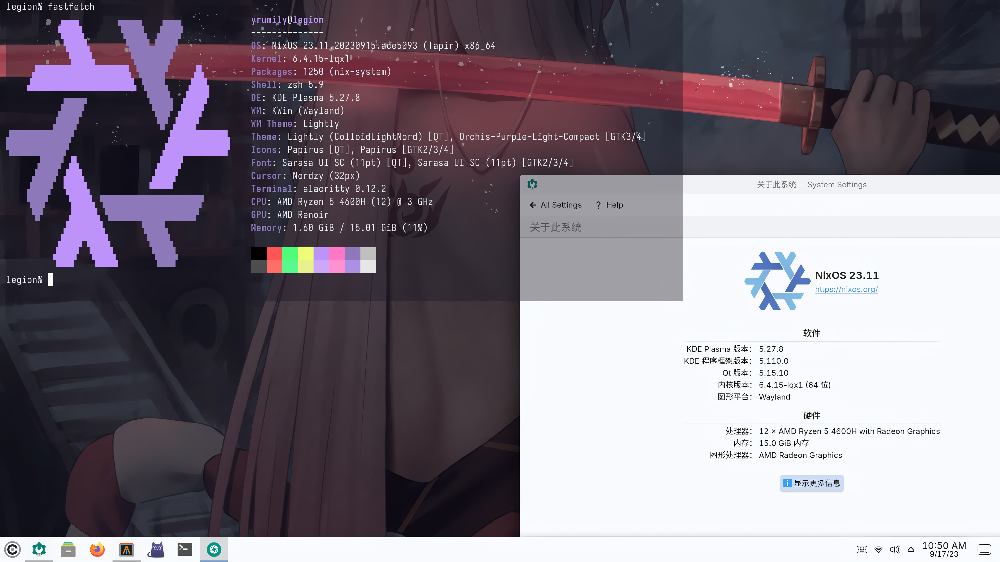

# Nix Configuration 



## 部署

### 安装

1. 格式化分区
2. 挂载
3. 生成一个基本的配置 
```bash
nixos-generate-config --root /mnt
```
4. 克隆仓库
```bash
export NIX_CONFIG="experimental-features = nix-command flakes" 

nix-shell -p git 

cd  /mnt/etc/nixos 

nix develop --extra-experimental-features nix-command --extra-experimental-features flakes
```
5. 拷贝 /mnt/etc/nixos 中的 `hardware-configuration.nix` 
6. 安装
```bash
nixos-install --no-root-passwd --flake .#legion

#或者指定源：
nixos-install --option substituters "https://mirrors.bfsu.edu.cn/nix-channels/store" --no-root-passwd --flake .#legion
```

### 重建

安装 NixOS 并启用 nix-command 和 flake 后，按照以下步骤部署

```bash
# 根据主机名部署其中一项配置
sudo nixos-rebuild switch --install-bootloader --flake .#legion
```

## 从 Flatpak 安装应用程序

可以从 flathub 安装应用程序，其中有很多应用程序在 nixpkgs 中得不到支持

```bash
# 添加 flathub 存储库
flatpak remote-add --if-not-exists flathub https://flathub.org/repo/flathub.flatpakrepo

# 从 flathub 安装应用程序
flatpak install netease-cloud-music-gtk

# 从 flathub 搜索应用程序
# 网站搜索: https://flathub.org/
flatpak search <keyword>
```

## 在 NixOS 上运行未修改的二进制文件

```shell
# 激活 FHS 会进入一个像普通 Linux 的 shell
$ fhs
(fhs) $ ls /usr/bin
(fhs) $ ./bin/code
```

对于其他方法: [在 Nixos 上运行非 nixos 可执行文件的方法](https://unix.stackexchange.com/questions/522822/different-methods-to-run-a-non-nixos-executable-on-nixos)
